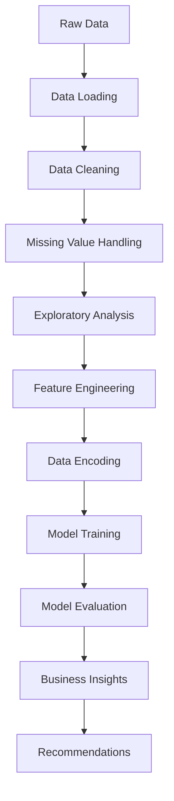

# Telco-Revenue-Guard-Predictive-Churn-Engine
This machine learning project analyzes telecommunications customer data to predict and understand churn patterns. Using a dataset of 7,043 customer records from a Washington state telecom provider, the analysis identifies key factors driving customer attrition and builds predictive models to support retention strategies.

# Telco Customer Churn Analytics 📊

A comprehensive machine learning project analyzing telecommunications customer data to predict and understand churn patterns. This project leverages data analysis and predictive modeling to identify at-risk customers and recommend retention strategies.

## 📋 Table of Contents
- [Overview](#overview)
- [Dataset](#dataset)
- [Project Structure](#project-structure)
- [Key Features](#key-features)
- [Installation](#installation)
- [Usage](#usage)
- [Project Workflow](#project-workflow)
- [Results](#results)
- [Key Insights](#key-insights)
- [Technologies](#technologies)
- [Contributing](#contributing)
- [License](#license)

## 🎯 Overview

This project analyzes a telecommunications company's customer data to:
- **Predict** which customers are likely to churn
- **Identify** key factors driving customer attrition
- **Segment** customers by risk level
- **Recommend** targeted retention strategies

**Business Impact:** Reducing churn by even 5% can significantly improve customer lifetime value and revenue sustainability.

## 📊 Dataset

### Basic Statistics
| Metric | Value |
|--------|-------|
| Total Records | 7,043 customers |
| Features | 20 attributes |
| Target Variable | Churn (Binary: Yes/No) |
| Data Source | Telecommunications Provider (Washington State) |

### Feature Categories

**Demographics**
- Gender
- Senior Citizen (Yes/No)
- Partner status
- Dependents

**Service Information**
- Tenure (months)
- Phone Service
- Multiple Lines
- Internet Service Type (DSL, Fiber optic, No internet)
- Streaming TV/Movies

**Additional Services**
- Online Security
- Online Backup
- Device Protection
- Tech Support

**Billing & Contract**
- Contract Type (Month-to-month, 1-year, 2-year)
- Paperless Billing
- Payment Method
- Monthly Charges
- Total Charges

## 📁 Project Structure

```
telco-churn-analytics/
│
├── README.md                               # Project documentation
├── PROJECT_DESCRIPTION.md                  # Detailed project overview
├── Product_Analytics.ipynb                 # Main analysis notebook
│
├── data/
│   └── WA_Fn-UseC_-Telco-Customer-Churn.csv  # Raw dataset
│
├── notebooks/
│   └── exploratory_analysis.ipynb          # EDA and visualizations
│
├── models/
│   └── churn_prediction_model.pkl          # Trained model (if applicable)
│
├── results/
│   ├── feature_importance.png              # Feature importance charts
│   ├── churn_distribution.png              # Churn analysis plots
│   └── model_performance.txt               # Model metrics summary
│
└── requirements.txt                        # Python dependencies
```

## 🔑 Key Features

### Data Processing
✅ Data loading and exploration  
✅ Missing value handling  
✅ Data type conversion and validation  
✅ Duplicate detection  
✅ Outlier identification  

### Analysis
✅ Exploratory Data Analysis (EDA)  
✅ Statistical correlations  
✅ Churn distribution analysis  
✅ Customer segment profiling  

### Modeling
✅ Feature engineering  
✅ Categorical variable encoding  
✅ Model training and evaluation  
✅ Performance metrics (Accuracy, Precision, Recall, F1, AUC-ROC)  

### Insights
✅ High-risk customer identification  
✅ Service impact on retention  
✅ Churn factor prioritization  
✅ Business recommendations  

## 🚀 Installation

### Prerequisites
- Python 3.7+
- Jupyter Notebook or JupyterLab
- pip or conda

### Setup

1. **Clone the repository**
   ```bash
   git clone https://github.com/yourusername/telco-churn-analytics.git
   cd telco-churn-analytics
   ```

2. **Create a virtual environment** (recommended)
   ```bash
   python -m venv venv
   source venv/bin/activate  # On Windows: venv\Scripts\activate
   ```

3. **Install dependencies**
   ```bash
   pip install -r requirements.txt
   ```

4. **Launch Jupyter Notebook**
   ```bash
   jupyter notebook
   ```

## 💻 Usage

### Quick Start
```python
import pandas as pd
import numpy as np

# Load the dataset
df = pd.read_csv('data/WA_Fn-UseC_-Telco-Customer-Churn.csv')

# View basic information
print(df.head())
print(df.info())
print(df['Churn'].value_counts())
```

### Running the Analysis
1. Open `Product_Analytics.ipynb` in Jupyter Notebook
2. Run cells sequentially (Cell → Run All)
3. Review visualizations and outputs
4. Check conclusions and recommendations

### Key Analysis Steps
- **Data Exploration:** Understand dataset structure and quality
- **Data Cleaning:** Handle missing values and inconsistencies
- **Feature Engineering:** Prepare features for modeling
- **EDA:** Analyze patterns and relationships
- **Modeling:** Train predictive models
- **Evaluation:** Assess model performance
- **Insights:** Extract actionable business intelligence

## 📈 Project Workflow



## 📊 Results

### Key Findings
- **Churn Rate:** [To be updated based on analysis]
- **Top Churn Drivers:** [To be updated based on model feature importance]
- **High-Risk Segments:** [To be updated based on segmentation analysis]
- **Model Accuracy:** [To be updated based on training results]

### Model Performance Metrics
| Metric | Value |
|--------|-------|
| Accuracy | - |
| Precision | - |
| Recall | - |
| F1-Score | - |
| AUC-ROC | - |

*Metrics will be populated after model training*

## 💡 Key Insights

### Expected Findings
1. **Contract Duration Impact:** Month-to-month contracts show higher churn
2. **Service Bundle Effect:** Customers with multiple services have lower churn
3. **Tenure Pattern:** New customers (< 6 months) have significantly higher churn
4. **Payment Method Influence:** Electronic check users may show different patterns
5. **Internet Service Type:** Fiber optic customers may exhibit different behavior

## 🛠️ Technologies

### Core Libraries
- **pandas** - Data manipulation and analysis
- **numpy** - Numerical computing
- **scikit-learn** - Machine learning algorithms
- **matplotlib** - Visualization
- **seaborn** - Statistical visualization
- **jupyter** - Interactive notebooks

### Optional Libraries
- **xgboost** - Gradient boosting models
- **lightgbm** - Fast gradient boosting
- **plotly** - Interactive visualizations
- **statsmodels** - Statistical modeling

## 📋 Requirements

```
pandas>=1.3.0
numpy>=1.21.0
scikit-learn>=1.0.0
matplotlib>=3.4.0
seaborn>=0.11.0
jupyter>=1.0.0
```

Install all requirements:
```bash
pip install -r requirements.txt
```

## 🤝 Contributing

Contributions are welcome! Please feel free to:
1. Fork the repository
2. Create a feature branch (`git checkout -b feature/AmazingFeature`)
3. Commit your changes (`git commit -m 'Add AmazingFeature'`)
4. Push to the branch (`git push origin feature/AmazingFeature`)
5. Open a Pull Request

## 📝 License

This project is licensed under the MIT License - see the [LICENSE](LICENSE) file for details.

## 📧 Contact & Support

For questions, suggestions, or issues:
- Open an issue on GitHub
- Contact: muskang1699@gmail.com
- LinkedIn: https://www.linkedin.com/in/muskanbhatt/
  
## 🙏 Acknowledgments

- Dataset source: [Kaggle / IBM Sample Datasets]
- Inspired by real-world telecommunications analytics challenges
- Community feedback and contributions

## 📚 Additional Resources

### Helpful Links
- [Scikit-learn Documentation](https://scikit-learn.org/stable/)
- [Pandas Documentation](https://pandas.pydata.org/)
- [Matplotlib Visualization Guide](https://matplotlib.org/)


**Project Status:** Active ✅  
**Difficulty Level:** Intermediate 📊
